# ISGA ARTI — Plateforme E-Commerce d'Articles Scolaires

> **Projet de Fin d'Études — Application Web Full-Stack**

| Information | Détail |
|---|---|
| **Étudiant(e)** | [Votre Nom] |
| **Établissement** | ISGA — Institut Supérieur de Gestion et d'Administration |
| **Année universitaire** | [Année Universitaire] |
| **Technologies principales** | Angular 21 · Spring Boot 4 · PostgreSQL · JWT · Stripe |
| **Nom du projet** | `isga-arti-frontend` / `boutique` (backend) |

---

## Table des matières

1. [Présentation du projet](#1-présentation-du-projet)
2. [Résumé](#2-résumé)
3. [Contexte général](#3-contexte-général)
4. [Problématique](#4-problématique)
5. [Objectifs du projet](#5-objectifs-du-projet)
6. [Technologies utilisées](#6-technologies-utilisées)
7. [Architecture globale](#7-architecture-globale)
8. [Architecture Backend Spring Boot](#8-architecture-backend-spring-boot)
9. [Architecture Frontend Angular](#9-architecture-frontend-angular)
10. [Fonctionnalités principales](#10-fonctionnalités-principales)
11. [Acteurs du système](#11-acteurs-du-système)
12. [Diagramme de cas d'utilisation](#12-diagramme-de-cas-dutilisation)
13. [Sélection de 6 cas d'utilisation](#13-sélection-de-6-cas-dutilisation)
14. [Diagrammes de séquence boîte blanche](#14-diagrammes-de-séquence-boîte-blanche)
15. [Diagramme d'activité](#15-diagramme-dactivité)
16. [Diagramme de classes métier](#16-diagramme-de-classes-métier)
17. [Diagramme de classes d'analyse](#17-diagramme-de-classes-danalyse)
18. [Diagramme de classes de conception](#18-diagramme-de-classes-de-conception)
19. [Diagramme de navigation](#19-diagramme-de-navigation)
20. [Diagramme de composants global](#20-diagramme-de-composants-global)
21. [Modèle de données](#21-modèle-de-données)
22. [Documentation des API REST](#22-documentation-des-api-rest)
23. [Sécurité](#23-sécurité)
24. [Gestion des erreurs et validation](#24-gestion-des-erreurs-et-validation)
25. [Tests et validation](#25-tests-et-validation)
26. [Installation et lancement](#26-installation-et-lancement)
27. [Structure du projet](#27-structure-du-projet)
28. [Captures d'écran](#28-captures-décran)
29. [Difficultés rencontrées](#29-difficultés-rencontrées)
30. [Solutions apportées](#30-solutions-apportées)
31. [Améliorations futures](#31-améliorations-futures)
32. [Conclusion générale](#32-conclusion-générale)
33. [Annexes](#33-annexes)

---

## 1. Présentation du projet

**ISGA ARTI** est une plateforme e-commerce complète dédiée à la vente d'articles scolaires en ligne. Développée dans le cadre d'un projet de fin d'études, cette application met en œuvre une architecture moderne client-serveur composée d'un frontend Angular 21 et d'un backend Spring Boot 4, communiquant via une API REST sécurisée par JWT (JSON Web Tokens).

La plateforme supporte trois rôles utilisateurs distincts — **Administrateur**, **Vendeur** et **Client** — chacun disposant d'un espace dédié avec des fonctionnalités spécialisées. Le système intègre un processus de paiement en ligne via **Stripe**, une gestion avancée des promotions (globales et ciblées), un panier persistant côté serveur, un tableau de bord analytique complet, ainsi qu'une gestion des fournisseurs avec traçabilité des opérations.

---

## 2. Résumé

L'application **ISGA ARTI** répond au besoin croissant de digitalisation du commerce d'articles scolaires. Elle offre une plateforme unifiée permettant aux clients de parcourir un catalogue de produits, de les ajouter à un panier intelligent synchronisé entre le navigateur et le serveur, d'appliquer des codes promotionnels et de finaliser leurs achats via un paiement sécurisé Stripe.

Pour les vendeurs, la plateforme fournit un espace dédié avec un tableau de bord riche en indicateurs clés de performance (KPI), incluant le suivi du chiffre d'affaires, la gestion de l'inventaire, l'association de fournisseurs aux produits, et la création de promotions locales sur leurs propres articles.

L'administrateur dispose quant à lui d'un panneau de contrôle centralisé offrant une vue globale sur l'ensemble de la plateforme : gestion des utilisateurs, des catégories, lancement de promotions globales, et accès à des statistiques avancées (répartition par catégorie, historique des revenus, performances des vendeurs).

Le choix technologique d'**Angular 21** pour le frontend se justifie par son architecture modulaire basée sur les Standalone Components, l'utilisation des Signals pour la gestion réactive de l'état, et le lazy-loading des routes pour des performances optimales. Côté backend, **Spring Boot 4** avec Spring Security, Spring Data JPA et PostgreSQL assure une architecture robuste, sécurisée et scalable, suivant le pattern Repository pour l'accès aux données.

---

## 3. Contexte général

Le commerce électronique connaît une expansion continue à l'échelle mondiale, touchant désormais tous les secteurs d'activité, y compris celui des fournitures scolaires. La numérisation de la vente d'articles scolaires répond à plusieurs enjeux majeurs :

- **Accessibilité** : permettre aux parents et étudiants de commander des fournitures depuis n'importe quel endroit, à tout moment.
- **Efficacité** : réduire les files d'attente et le temps consacré aux achats de rentrée scolaire.
- **Gestion centralisée** : offrir aux vendeurs et administrateurs des outils numériques pour gérer efficacement les stocks, les prix et les promotions.
- **Traçabilité** : assurer un suivi complet des commandes, des paiements et des opérations effectuées par chaque acteur.

Dans ce contexte, la plateforme **ISGA ARTI** se positionne comme une solution technique complète, intégrant les bonnes pratiques du développement web moderne et répondant aux exigences fonctionnelles d'une application e-commerce professionnelle.

---

## 4. Problématique

**Comment concevoir et développer une plateforme e-commerce multi-acteurs, sécurisée et performante, dédiée aux articles scolaires, en utilisant les technologies Angular et Spring Boot, tout en garantissant une expérience utilisateur fluide, un processus de paiement fiable et une administration centralisée efficace ?**

Cette problématique soulève plusieurs sous-questions :

- Comment implémenter une authentification et une autorisation robustes avec des rôles différenciés (Administrateur, Vendeur, Client) ?
- Comment concevoir un panier d'achat hybride fonctionnant à la fois côté client (localStorage) et côté serveur (base de données) ?
- Comment intégrer un service de paiement externe (Stripe) de manière sécurisée ?
- Comment fournir des tableaux de bord analytiques pertinents pour chaque type d'acteur ?

---

## 5. Objectifs du projet

### Objectif général

Concevoir et développer une application web e-commerce complète, fonctionnelle et sécurisée, dédiée à la vente d'articles scolaires, en adoptant une architecture full-stack moderne avec Angular 21 et Spring Boot 4.

### Objectifs spécifiques

1. **Authentification et autorisation** : implémenter un système d'inscription et de connexion sécurisé basé sur JWT avec gestion de trois rôles (ROLE_ADMIN, ROLE_VENDEUR, ROLE_CLIENT).
2. **Catalogue produits** : développer un module de consultation du catalogue avec filtrage par catégorie, affichage des détails produit et intégration des promotions actives.
3. **Panier d'achat intelligent** : concevoir un panier hybride (localStorage + base de données) avec synchronisation automatique lors de la connexion du client, support des codes promotionnels et calcul automatique des frais de livraison et taxes.
4. **Paiement en ligne** : intégrer Stripe pour les transactions sécurisées, avec support de Checkout Session et PaymentIntent, mise à jour automatique des stocks après paiement.
5. **Espace vendeur** : fournir un tableau de bord complet avec gestion CRUD des produits, upload d'images via ImageKit.io, gestion des fournisseurs, création de promotions locales, et suivi des KPI.
6. **Espace administrateur** : développer un panneau d'administration avec gestion des utilisateurs, des catégories, des promotions globales, et des statistiques analytiques avec graphiques (Chart.js).
7. **Adresses de livraison** : permettre aux clients d'enregistrer et de gérer leurs adresses de livraison.
8. **Traçabilité** : implémenter un système de journalisation des opérations (CategorieOperation, VendeurOperation) pour l'audit.

---

## 6. Technologies utilisées

### Frontend

| Technologie | Version | Rôle |
|---|---|---|
| **Angular** | 21.2.0 | Framework SPA principal, architecture à base de Standalone Components |
| **TypeScript** | 5.9.2 | Langage typé statiquement pour la fiabilité du code frontend |
| **Tailwind CSS** | 3.4.19 | Framework CSS utilitaire pour un design responsive et moderne |
| **Lucide Angular** | 1.0.0 | Bibliothèque d'icônes SVG optimisées pour l'interface utilisateur |
| **Chart.js** | 4.5.1 | Bibliothèque de visualisation de données pour les graphiques des tableaux de bord |
| **RxJS** | 7.8 | Gestion des flux asynchrones et communication HTTP réactive |

### Backend

| Technologie | Version | Rôle |
|---|---|---|
| **Spring Boot** | 4.0.5 | Framework Java pour le développement rapide d'API REST |
| **Spring Security** | (intégré) | Module d'authentification et d'autorisation avec JWT |
| **Spring Data JPA** | (intégré) | Couche d'abstraction ORM pour l'accès à la base de données |
| **Spring Validation** | (intégré) | Validation des données entrantes via annotations Jakarta Validation |
| **Lombok** | (intégré) | Réduction du code boilerplate Java (@Getter, @Setter, etc.) |
| **JJWT** | 0.11.5 | Bibliothèque de génération et validation des tokens JWT |
| **Jackson** | (intégré) | Sérialisation/désérialisation JSON |
| **Java** | 17 | Langage de programmation backend |

### Base de données

| Technologie | Rôle |
|---|---|
| **PostgreSQL** | Système de gestion de base de données relationnelle, choisi pour sa robustesse et sa conformité SQL |

### Outils de développement

| Outil | Rôle |
|---|---|
| **Maven** | Gestionnaire de dépendances et outil de build pour le backend Java |
| **npm** | Gestionnaire de paquets pour le frontend Angular |
| **Angular CLI** | Interface en ligne de commande pour la génération et le build du frontend |
| **PostCSS** | Outil de transformation CSS (intégration Tailwind) |
| **Prettier** | Formateur de code pour assurer la cohérence stylistique |

### Services externes

| Service | Rôle |
|---|---|
| **Stripe** | Plateforme de paiement en ligne sécurisée (Checkout Sessions, PaymentIntents) |
| **ImageKit.io** | Service CDN et d'hébergement d'images pour l'upload des photos produits |

---

## 7. Architecture globale

L'application adopte une **architecture client-serveur en couches**, avec une séparation stricte entre le frontend (présentation) et le backend (logique métier et accès aux données). La communication se fait exclusivement via une API REST JSON sécurisée par JWT.

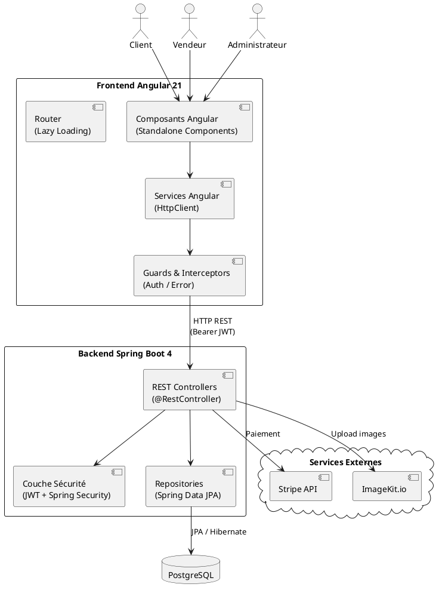

### Communication client-serveur

1. Le **frontend Angular** envoie des requêtes HTTP (GET, POST, PUT, PATCH, DELETE) au backend.
2. L'**intercepteur d'authentification** (`authInterceptor`) ajoute automatiquement le token JWT dans l'en-tête `Authorization: Bearer <token>`.
3. Le **filtre JWT** (`AuthTokenFilter`) côté backend extrait et valide le token avant de transmettre la requête au contrôleur approprié.
4. Les **annotations `@PreAuthorize`** restreignent l'accès aux endpoints en fonction du rôle de l'utilisateur.
5. Les **réponses JSON** sont renvoyées au frontend, qui met à jour l'interface de manière réactive grâce aux Signals Angular.

---

## 8. Architecture Backend Spring Boot

Le backend suit le pattern **Controller → Repository** avec une couche de sécurité transversale. La logique métier est principalement encapsulée dans les contrôleurs eux-mêmes.

### 8.1 Contrôleurs (`controllers/`)

| Contrôleur | Mapping | Rôle |
|---|---|---|
| `AuthController` | `/api/auth` | Inscription (`/signup`) et connexion (`/signin`) avec génération JWT |
| `AdminController` | `/api` | Gestion des utilisateurs, catégories, promotions globales et statistiques |
| `ProduitController` | `/api/produits` | Consultation publique du catalogue, création de produits |
| `PanierController` | `/api/cart` | Gestion CRUD du panier, fusion panier local, application de codes promo |
| `PaymentController` | `/api/payments` | Intégration Stripe (Checkout Sessions, PaymentIntents, confirmation) |
| `VendeurController` | `/api/vendeur` | CRUD produits vendeur, fournisseurs, promotions locales, dashboard, upload images |
| `ShippingAddressController` | `/api/shipping-addresses` | Gestion des adresses de livraison du client |

### 8.2 Entités (`models/`)

| Entité | Table | Description |
|---|---|---|
| `BaseEntity` | *(MappedSuperclass)* | Classe abstraite avec champs d'audit `createdAt` et `updatedAt` |
| `User` | `users` | Utilisateur avec nom, email, mot de passe et rôles (ManyToMany) |
| `Role` | `roles` | Rôle utilisateur (ROLE_ADMIN, ROLE_VENDEUR, ROLE_CLIENT) |
| `Produit` | `produits` | Article scolaire avec prix, stock, description, image, galerie |
| `Categorie` | `categories` | Catégorie de produits avec nom et description |
| `Commande` | `commandes` | Commande avec numéro, statut, total, informations Stripe et livraison |
| `LigneCommande` | `ligne_commandes` | Ligne de commande avec quantité et prix unitaire figé |
| `Panier` | `paniers` | Panier client (OneToOne avec User) |
| `PanierItem` | `panier_items` | Article dans le panier (contrainte unique panier+produit) |
| `Promotion` | `promotions` | Promotion avec pourcentage, dates, type cible et code promo |
| `Fournisseur` | `fournisseurs` | Fournisseur avec nom, email, téléphone et latence |
| `ShippingAddress` | `shipping_addresses` | Adresse de livraison du client |
| `CategorieOperation` | `categorie_operations` | Journal des opérations sur les catégories (audit) |
| `VendeurOperation` | `vendeur_operations` | Journal des opérations du vendeur (audit) |

### 8.3 Repositories (`repositories/`)

| Repository | Entité | Méthodes personnalisées notables |
|---|---|---|
| `UserRepository` | `User` | `findByEmail()`, `existsByEmail()` |
| `RoleRepository` | `Role` | `findByName()` |
| `ProduitRepository` | `Produit` | `findByCategorieId()`, `findByVendeurId()`, `findByVendeurIsNull()`, `countByCategorieId()`, `countByVendeurId()` |
| `CategorieRepository` | `Categorie` | `findByNom()` |
| `CommandeRepository` | `Commande` | `findByClientId()`, `findByNumeroCommande()`, `findByStripeSessionId()`, `findByStripePaymentIntentId()` |
| `PanierRepository` | `Panier` | `findByClientId()` |
| `PanierItemRepository` | `PanierItem` | `findByPanierIdAndProduitId()` |
| `PromotionRepository` | `Promotion` | `findByIsGlobalTrue()`, `findByProduitConcerneId()`, `findByCodeIgnoreCase()` |
| `FournisseurRepository` | `Fournisseur` | Hérite des méthodes JpaRepository |
| `ShippingAddressRepository` | `ShippingAddress` | `findByClientIdOrderByDefaultAddressDescUpdatedAtDesc()` |
| `CategorieOperationRepository` | `CategorieOperation` | `findTop8ByOrderByCreatedAtDesc()` |
| `VendeurOperationRepository` | `VendeurOperation` | `findTop50ByVendeurIdOrderByCreatedAtDesc()` |

### 8.4 DTOs / Payloads (`payload/`)

| Classe | Rôle | Validations |
|---|---|---|
| `LoginRequest` | Données de connexion | `@NotBlank` sur email et password |
| `SignupRequest` | Données d'inscription | `@NotBlank` sur nom, `@Email` et `@NotBlank` sur email, `@NotBlank` sur password |

### 8.5 Sécurité (`security/`)

| Classe | Rôle |
|---|---|
| `WebSecurityConfig` | Configuration centrale Spring Security : CORS, CSRF désactivé, politique stateless, règles d'accès par rôle, filtre JWT |
| `AuthTokenFilter` | Filtre HTTP qui intercepte chaque requête, extrait et valide le JWT, puis charge les détails utilisateur |
| `JwtUtils` | Utilitaire pour générer, valider et extraire les informations des tokens JWT (HS256) |
| `UserDetailsImpl` | Implémentation de `UserDetails` de Spring Security, convertit l'entité `User` en objet de sécurité |
| `UserDetailsServiceImpl` | Charge les détails utilisateur depuis la base de données pour l'authentification |
| `AuthEntryPointJwt` | Gère les requêtes non authentifiées en renvoyant une erreur 401 |
| `DataSeeder` | Initialise les rôles par défaut au démarrage (ROLE_ADMIN, ROLE_VENDEUR, ROLE_CLIENT) |

---

## 9. Architecture Frontend Angular

Le frontend Angular 21 adopte une architecture modulaire stricte basée sur les **Standalone Components** et utilise les **Signals** pour la gestion réactive de l'état.

### 9.1 Structure des dossiers

```
src/app/
├── app.ts                    # Composant racine
├── app.config.ts             # Configuration applicative (providers, interceptors, icons)
├── app.routes.ts             # Définition des routes avec lazy-loading
├── core/                     # Logique métier centrale (singletons)
│   ├── guards/               # Guards de navigation
│   │   └── guards.ts         # authGuard, adminGuard, vendeurGuard, guestGuard
│   ├── interceptors/         # Intercepteurs HTTP
│   │   ├── auth.interceptor.ts
│   │   └── error.interceptor.ts
│   └── services/             # Services injectables
│       ├── auth.service.ts
│       ├── admin.service.ts
│       ├── cart.service.ts
│       ├── product.service.ts
│       ├── vendeur.service.ts
│       └── nexus-notification.service.ts
├── features/                 # Modules fonctionnels
│   ├── auth/                 # Authentification
│   │   ├── login/
│   │   ├── register/
│   │   └── particle-background/
│   ├── admin/                # Espace administrateur
│   │   ├── dashboard/
│   │   ├── vendeurs/
│   │   ├── categories/
│   │   ├── promotions/
│   │   └── products/
│   ├── vendeur/              # Espace vendeur
│   │   ├── dashboard/
│   │   ├── inventory/
│   │   ├── fournisseurs/
│   │   └── promotions/
│   └── storefront/           # Vitrine client
│       ├── home/
│       ├── products/
│       │   ├── product-card/
│       │   ├── product-details/
│       │   └── product-list.component.ts
│       └── cart/
└── shared/                   # Composants réutilisables
    ├── layout/
    │   ├── shell/            # Coque de navigation principale
    │   └── dock/             # Barre de navigation
    └── components/
        ├── nexus-notification/
        └── vendeur-background/
```

### 9.2 Services (`core/services/`)

| Service | Rôle |
|---|---|
| `AuthService` | Connexion, inscription, déconnexion, parsing JWT, gestion de l'état utilisateur via Signals |
| `AdminService` | Appels API pour la gestion des utilisateurs, catégories, promotions globales et statistiques admin |
| `CartService` | Panier hybride localStorage + API serveur, synchronisation automatique, calcul des totaux via Signals computed |
| `ProductService` | Consultation du catalogue, détails produit, gestion des catégories |
| `VendeurService` | CRUD produits vendeur, fournisseurs, promotions locales, dashboard, upload images |
| `NexusNotificationService` | Système de notifications toast avec auto-suppression (success, error, info) |

### 9.3 Guards (`core/guards/`)

| Guard | Rôle |
|---|---|
| `authGuard` | Redirige vers `/login` si l'utilisateur n'est pas authentifié |
| `adminGuard` | Vérifie `ROLE_ADMIN`, redirige les vendeurs vers `/vendeur`, les autres vers `/` |
| `vendeurGuard` | Vérifie `ROLE_VENDEUR`, redirige les admins vers `/admin`, les autres vers `/` |
| `guestGuard` | Empêche les utilisateurs connectés d'accéder aux pages de connexion/inscription |

### 9.4 Intercepteurs (`core/interceptors/`)

| Intercepteur | Rôle |
|---|---|
| `authInterceptor` | Ajoute automatiquement le header `Authorization: Bearer <token>` à chaque requête HTTP |
| `errorInterceptor` | Intercepte les erreurs HTTP 401 (déconnexion si authentification invalide) et 403 (accès refusé) |

### 9.5 Routes

| Route | Composant | Guard | Rôle |
|---|---|---|---|
| `/login` | `LoginComponent` | `guestGuard` | Page de connexion |
| `/register` | `RegisterComponent` | `guestGuard` | Page d'inscription |
| `/` | `HomeComponent` | `authGuard` | Page d'accueil |
| `/produits` | `ProductListComponent` | `authGuard` | Catalogue produits |
| `/produits/:id` | `ProductDetailsComponent` | `authGuard` | Détails d'un produit |
| `/panier` | `CartComponent` | `authGuard` | Panier d'achat |
| `/admin` | `AdminDashboardComponent` | `adminGuard` | Tableau de bord admin |
| `/admin/vendeurs` | `AdminVendeursComponent` | `adminGuard` | Gestion des vendeurs |
| `/admin/categories` | `AdminCategoriesComponent` | `adminGuard` | Gestion des catégories |
| `/admin/promotions` | `AdminPromotionsComponent` | `adminGuard` | Gestion des promotions |
| `/admin/produits/nouveau` | `ProductFormComponent` | `adminGuard` | Formulaire de création produit |
| `/vendeur` | `VendeurDashboardComponent` | `vendeurGuard` | Tableau de bord vendeur |
| `/vendeur/inventaire` | `VendeurInventoryComponent` | `vendeurGuard` | Gestion de l'inventaire |
| `/vendeur/fournisseurs` | `VendeurFournisseursComponent` | `vendeurGuard` | Gestion des fournisseurs |
| `/vendeur/promotions` | `VendeurPromotionsComponent` | `vendeurGuard` | Gestion des promotions locales |

### 9.6 Interfaces TypeScript

Les interfaces clés définies dans le projet :

- `User` (dans `auth.service.ts`) : `id`, `email`, `roles[]`
- `Produit` (dans `product.service.ts`) : `id`, `nom`, `prix`, `stock`, `description`, `image`, `images`, `promo`, `promoEnd`, `promoActive`, `promoId`, `promoName`, `promoCode`, `categorie`, `vendeur`
- `Categorie` (dans `product.service.ts`) : `id`, `nom`
- `CartItem` (dans `cart.service.ts`) : étend `Produit` avec `quantity`
- `Fournisseur` (dans `vendeur.service.ts`) : `id`, `nom`, `email`, `telephone`, `latency`
- `PromotionLocale` (dans `vendeur.service.ts`) : `pourcentage`, `dateFin`, `nom`
- `VendeurDashboardData` (dans `vendeur.service.ts`) : `vendor`, `kpis`, `products[]`, `promotions[]`, `shipments[]`, `activity[]`, `revenueSeries[]`
- `NexusNotify` (dans `nexus-notification.service.ts`) : `id`, `msg`, `type`

---

## 10. Fonctionnalités principales

### 10.1 Authentification et gestion des rôles

- **Inscription** avec choix du rôle (Client ou Vendeur)
- **Connexion** avec email et mot de passe, retour d'un token JWT contenant les rôles
- **Déconnexion** avec nettoyage du localStorage et redirection
- **Parsing client-side du JWT** pour extraire les rôles sans requête serveur supplémentaire
- **Acteur** : tous les utilisateurs
- **Frontend** : `LoginComponent`, `RegisterComponent`, `AuthService`
- **Backend** : `AuthController` (signup/signin), `JwtUtils`, `AuthTokenFilter`, `WebSecurityConfig`

### 10.2 Catalogue produits et vitrine

- **Consultation** de la liste des produits avec informations de promotion actives
- **Détail produit** avec prix, stock, description, galerie d'images, informations vendeur
- **Intégration des promotions** : affichage dynamique du prix réduit et du code promo
- **Acteur** : Client (principalement), tous les utilisateurs authentifiés
- **Frontend** : `ProductListComponent`, `ProductDetailsComponent`, `ProductCardComponent`
- **Backend** : `ProduitController` (GET /api/produits, GET /api/produits/{id}) — endpoints publics

### 10.3 Panier d'achat intelligent

- **Ajout/suppression** de produits avec gestion des quantités
- **Panier hybride** : localStorage pour les visiteurs, base de données (`paniers` + `panier_items`) pour les clients connectés
- **Synchronisation automatique** : fusion du panier local vers le serveur lors de la connexion (`POST /api/cart/merge`)
- **Application de codes promo** : validation côté serveur, vérification de la compatibilité produit/catégorie
- **Calcul automatique** : sous-total, frais de livraison (gratuite au-delà de 200 MAD), taxes (15%), remises
- **Acteur** : Client
- **Frontend** : `CartComponent`, `CartService` (Signals computed pour totaux réactifs)
- **Backend** : `PanierController` (CRUD items, merge, promo/apply)

### 10.4 Paiement Stripe

- **Checkout Session** (mode embarqué) : création de session Stripe avec redirection intégrée
- **PaymentIntent** : flux alternatif avec paiement par carte sans redirection
- **Confirmation** : vérification du statut du paiement auprès de Stripe, mise à jour du statut de la commande
- **Mise à jour automatique du stock** : décrémentation du stock de chaque produit après paiement réussi
- **Vidage automatique du panier** après paiement confirmé
- **Acteur** : Client
- **Frontend** : `CartComponent` (intégration Stripe Embedded Checkout)
- **Backend** : `PaymentController` (checkout-session, payment-intent, confirm), record `OrderPricing`
- **Impact BDD** : création de `Commande` + `LigneCommande`, mise à jour de `Produit.stock`

### 10.5 Espace administrateur

- **Gestion des utilisateurs** : liste, approbation, modification de rôle, suppression
- **Gestion des catégories** : CRUD complet avec journalisation des opérations (`CategorieOperation`)
- **Promotions globales** : création de promotions ciblant tous les produits, une catégorie ou un produit spécifique, avec codes promo
- **Statistiques avancées** : total utilisateurs, vendeurs, produits, catégories, promotions ; répartition par catégorie (doughnut chart) ; historique des revenus sur 6 mois (line chart) ; top 8 vendeurs par achats ; alertes récentes d'achats ; revenu mensuel, objectif, panier moyen, annulations
- **Acteur** : Administrateur
- **Frontend** : `AdminDashboardComponent`, `AdminVendeursComponent`, `AdminCategoriesComponent`, `AdminPromotionsComponent`, `ProductFormComponent`
- **Backend** : `AdminController` (utilisateurs, catégories, promotions, stats)

### 10.6 Espace vendeur

- **Dashboard KPI** : chiffre d'affaires, expéditions, nombre de produits, stock total, valeur de l'inventaire, promotions actives
- **Gestion produits** : CRUD complet (ajout, modification, suppression), upload d'images via ImageKit.io
- **Gestion des fournisseurs** : ajout de fournisseurs, association fournisseur-produit (ManyToMany)
- **Promotions locales** : création, activation/désactivation, suppression de promotions sur ses propres produits
- **Journal d'activité** : historique des 30 dernières opérations (ajouts, modifications, promotions, commandes)
- **Série de revenus** : évolution du chiffre d'affaires sur les 11 derniers jours
- **Acteur** : Vendeur
- **Frontend** : `VendeurDashboardComponent`, `VendeurInventoryComponent`, `VendeurFournisseursComponent`, `VendeurPromotionsComponent`
- **Backend** : `VendeurController` (produits, fournisseurs, promotions, dashboard, upload-image)

### 10.7 Gestion des adresses de livraison

- **Enregistrement** d'adresses avec nom complet, email, ville, pays, téléphone, adresse postale
- **Adresse par défaut** automatiquement définie pour la première adresse enregistrée
- **Acteur** : Client
- **Frontend** : `CartComponent` (formulaire d'adresse intégré)
- **Backend** : `ShippingAddressController` (GET, POST)

### 10.8 Système de notifications

- **Notifications toast** en temps réel pour les actions utilisateur (succès, erreur, information)
- **Auto-suppression** après 4 secondes
- **Frontend** : `NexusNotificationService`, `NexusNotificationComponent`

---

## 11. Acteurs du système

### 11.1 Client (`ROLE_CLIENT`)

L'acteur principal de la plateforme. Après inscription et connexion, le client peut :
- Parcourir le catalogue de produits
- Consulter les détails d'un produit (prix, stock, description, images, promotions)
- Ajouter/retirer des produits au panier
- Appliquer un code promotionnel
- Enregistrer une adresse de livraison
- Effectuer un paiement via Stripe
- Recevoir une confirmation de commande

### 11.2 Vendeur (`ROLE_VENDEUR`)

Le vendeur gère son propre catalogue de produits au sein de la plateforme. Il peut :
- Accéder à un tableau de bord avec KPI personnalisés
- Ajouter, modifier, supprimer ses produits
- Uploader des images de produits via ImageKit.io
- Gérer ses fournisseurs et les associer à ses produits
- Créer, activer/désactiver, supprimer des promotions sur ses produits
- Consulter l'historique de ses ventes et opérations

### 11.3 Administrateur (`ROLE_ADMIN`)

L'administrateur supervise l'ensemble de la plateforme. Il peut :
- Gérer les utilisateurs (approbation, changement de rôle, suppression)
- Gérer les catégories de produits (CRUD)
- Lancer des promotions globales (sur tout le catalogue, une catégorie ou un produit)
- Consulter des statistiques avancées (revenus, répartition par catégorie, top vendeurs)
- Ajouter des produits au catalogue

---

## 12. Diagramme de cas d'utilisation

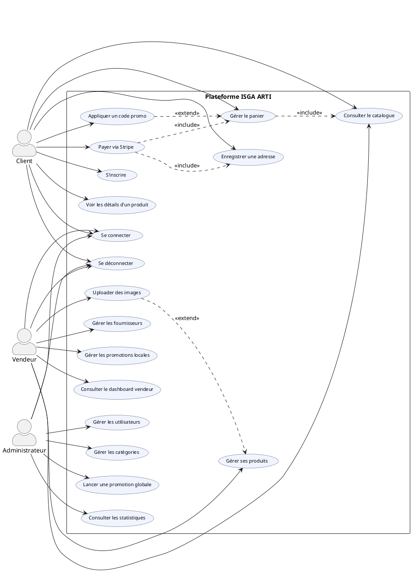

---

## 13. Sélection de 6 cas d'utilisation

### CU1 — Se connecter

| Élément | Description |
|---|---|
| **Titre** | Se connecter |
| **Acteur principal** | Client / Vendeur / Administrateur |
| **Objectif** | Accéder à la plateforme en s'authentifiant avec email et mot de passe |
| **Préconditions** | L'utilisateur possède un compte enregistré et actif |
| **Scénario principal** | 1. L'utilisateur accède à la page `/login` 2. Il saisit son email et son mot de passe 3. Il clique sur le bouton de connexion 4. Le frontend envoie `POST /api/auth/signin` 5. Le backend vérifie les identifiants via Spring Security et BCrypt 6. Un token JWT est généré et renvoyé 7. Le frontend stocke le token dans localStorage et parse les rôles 8. L'utilisateur est redirigé vers la page appropriée selon son rôle |
| **Scénarios alternatifs** | **SA1** — Email inexistant : erreur 401, message affiché. **SA2** — Mot de passe incorrect : erreur 401, message affiché. **SA3** — Utilisateur déjà connecté : le `guestGuard` redirige vers `/` |
| **Postconditions** | Le token JWT est stocké, l'état utilisateur est mis à jour via Signals |

### CU2 — Consulter le catalogue

| Élément | Description |
|---|---|
| **Titre** | Consulter le catalogue de produits |
| **Acteur principal** | Client |
| **Objectif** | Visualiser l'ensemble des articles scolaires disponibles |
| **Préconditions** | L'utilisateur est authentifié |
| **Scénario principal** | 1. Le client navigue vers `/produits` 2. Le `ProductListComponent` appelle `ProductService.getProducts()` 3. Le backend charge tous les produits et enrichit chaque produit avec sa promotion active éventuelle 4. La liste des produits s'affiche avec images, prix, stock et badge promo 5. Le client peut filtrer par catégorie ou rechercher par mot-clé |
| **Scénarios alternatifs** | **SA1** — Aucun produit disponible : message informatif affiché. **SA2** — Erreur serveur : notification d'erreur |
| **Postconditions** | Le catalogue est affiché avec les promotions actives |

### CU3 — Gérer le panier

| Élément | Description |
|---|---|
| **Titre** | Gérer le panier d'achat |
| **Acteur principal** | Client |
| **Objectif** | Ajouter, modifier la quantité et supprimer des articles du panier |
| **Préconditions** | L'utilisateur est authentifié en tant que Client |
| **Scénario principal** | 1. Le client ajoute un produit au panier depuis la liste ou la page de détail 2. Le `CartService` ajoute localement (Signal) puis synchronise avec le serveur (`POST /api/cart/items`) 3. Le client navigue vers `/panier` 4. Il peut modifier les quantités (`PUT /api/cart/items/{productId}`) ou supprimer un article (`DELETE /api/cart/items/{productId}`) 5. Les totaux sont recalculés automatiquement via Signals computed |
| **Scénarios alternatifs** | **SA1** — Quantité mise à 0 : l'article est automatiquement supprimé. **SA2** — Panier fusionné lors de la connexion : les items du localStorage sont envoyés via `POST /api/cart/merge` |
| **Postconditions** | Le panier est synchronisé entre le frontend et la base de données |

### CU4 — Payer via Stripe

| Élément | Description |
|---|---|
| **Titre** | Effectuer un paiement en ligne via Stripe |
| **Acteur principal** | Client |
| **Objectif** | Finaliser l'achat des articles du panier en effectuant un paiement sécurisé |
| **Préconditions** | Le panier est non vide, le client a renseigné une adresse de livraison |
| **Scénario principal** | 1. Le client clique sur « Procéder au paiement » 2. Le frontend envoie `POST /api/payments/stripe/checkout-session` avec les informations d'adresse et le code promo éventuel 3. Le backend calcule le pricing (sous-total, livraison, taxes, remise), crée une `Commande` en statut PAYMENT_PENDING, puis crée une session Stripe 4. Le frontend initialise le composant Stripe Embedded Checkout avec le `clientSecret` 5. Le client complète le formulaire de carte bancaire sur l'interface Stripe 6. Après succès, le frontend appelle `GET /api/payments/stripe/session/{sessionId}` 7. Le backend vérifie le statut auprès de Stripe, marque la commande comme PAYEE, décrémente les stocks, vide le panier 8. Le client reçoit la confirmation avec le récapitulatif de la commande |
| **Scénarios alternatifs** | **SA1** — Paiement échoué : le statut reste PENDING, message d'erreur affiché. **SA2** — Stripe non configuré : erreur 503 renvoyée. **SA3** — Panier vide : erreur 400 |
| **Postconditions** | Commande créée avec statut PAYEE, stocks mis à jour, panier vidé |

### CU5 — Gérer ses produits (Vendeur)

| Élément | Description |
|---|---|
| **Titre** | Gérer les produits en tant que vendeur |
| **Acteur principal** | Vendeur |
| **Objectif** | Ajouter, modifier et supprimer les produits de son propre catalogue |
| **Préconditions** | L'utilisateur est authentifié en tant que Vendeur |
| **Scénario principal** | 1. Le vendeur accède à `/vendeur/inventaire` 2. La liste de ses produits est affichée (`GET /api/vendeur/produits`) 3. Il peut ajouter un nouveau produit avec nom, prix, stock, description, catégorie et images 4. L'image est uploadée via `POST /api/vendeur/upload-image` (transfert vers ImageKit.io) 5. Le produit est créé via `POST /api/vendeur/produits` 6. Le vendeur peut modifier un produit existant (`PUT /api/vendeur/produits/{id}`) ou le supprimer (`DELETE /api/vendeur/produits/{id}`) 7. Chaque opération est journalisée dans `VendeurOperation` |
| **Scénarios alternatifs** | **SA1** — Tentative de modifier un produit d'un autre vendeur : erreur 403. **SA2** — Produit sans catégorie : la catégorie est requise |
| **Postconditions** | Le produit est créé/modifié/supprimé, l'opération est tracée |

### CU6 — Consulter les statistiques (Administrateur)

| Élément | Description |
|---|---|
| **Titre** | Consulter les statistiques de la plateforme |
| **Acteur principal** | Administrateur |
| **Objectif** | Visualiser les indicateurs clés de performance de la plateforme |
| **Préconditions** | L'utilisateur est authentifié en tant qu'Administrateur |
| **Scénario principal** | 1. L'administrateur accède à `/admin` 2. Le `AdminDashboardComponent` appelle `AdminService.getAdminStats()` 3. Le backend (`GET /api/admin/stats`) agrège les données : total utilisateurs, vendeurs, produits, catégories, promotions ; répartition des produits par catégorie ; historique des revenus sur 6 mois ; top 8 vendeurs par volume d'achats ; alertes d'achats récents ; revenu mensuel, objectif, panier moyen, annulations 4. Le frontend affiche les données sous forme de cartes KPI, graphiques doughnut (répartition par catégorie), graphiques ligne (historique des revenus), et tableaux (top vendeurs, alertes) |
| **Scénarios alternatifs** | **SA1** — Aucune commande payée : les graphiques affichent des valeurs nulles |
| **Postconditions** | Le tableau de bord est affiché avec les statistiques à jour |

---

## 14. Diagrammes de séquence boîte blanche

### DS1 — Se connecter

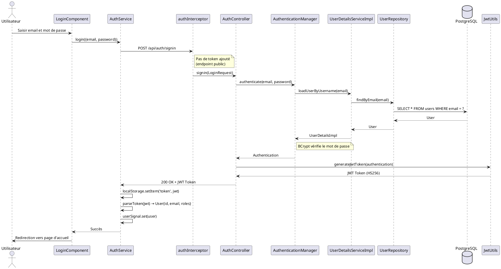

### DS2 — Consulter le catalogue

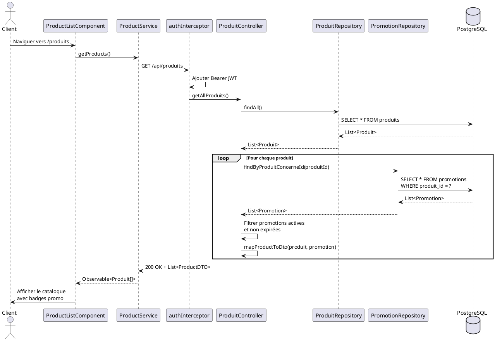

### DS3 — Gérer le panier

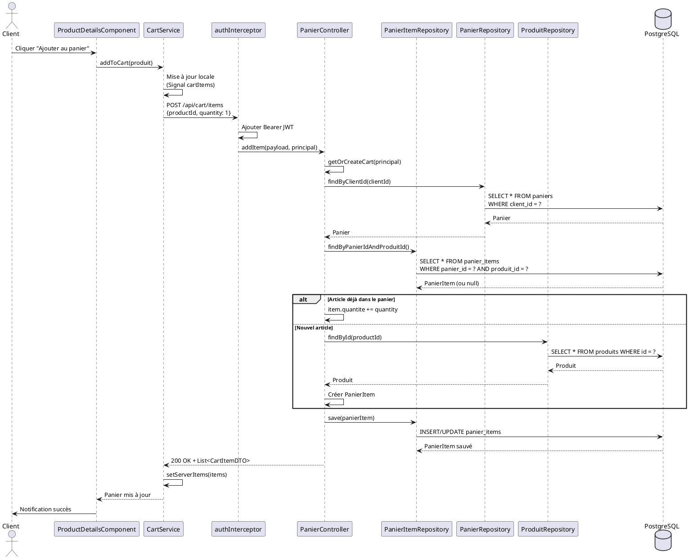

### DS4 — Payer via Stripe

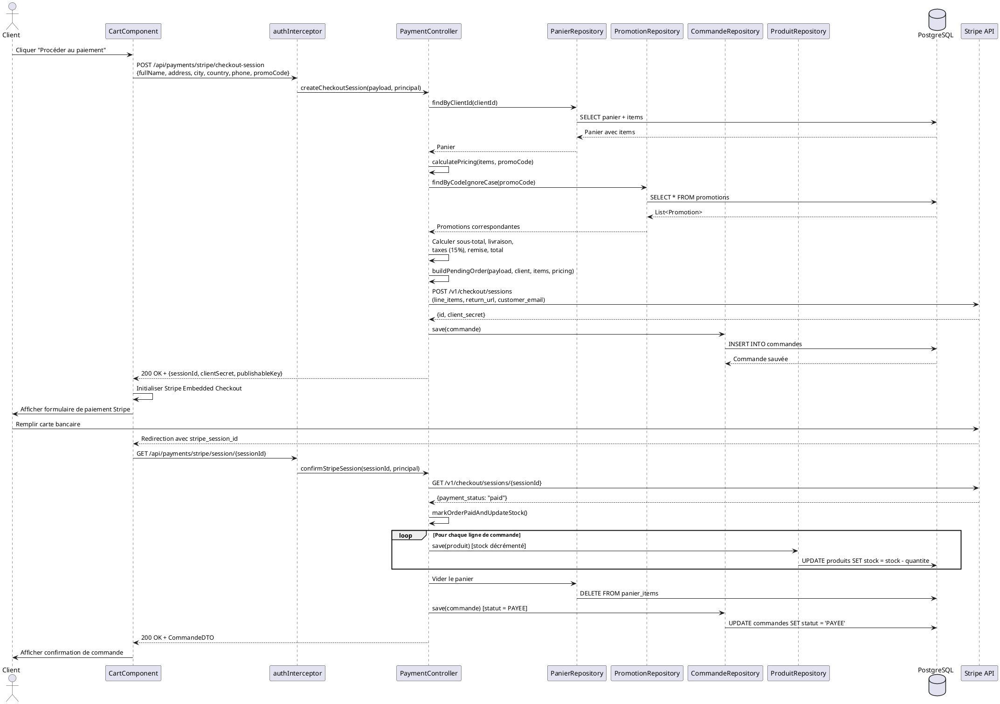

### DS5 — Gérer ses produits (Vendeur)

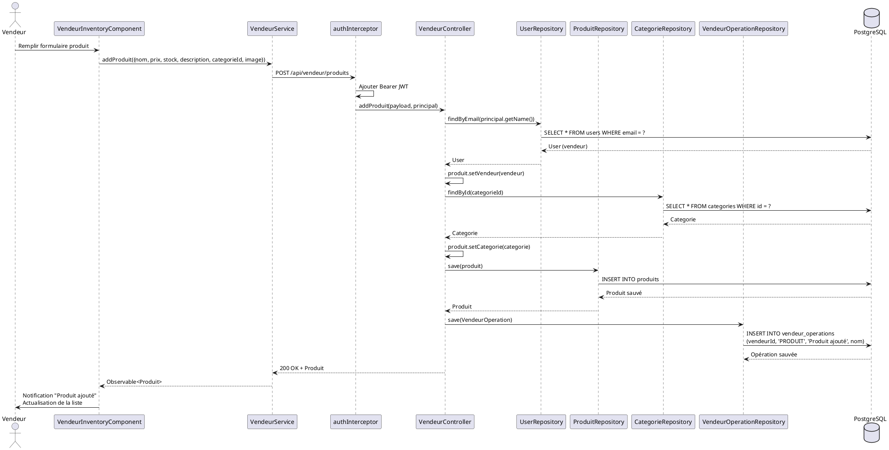

### DS6 — Consulter les statistiques (Administrateur)

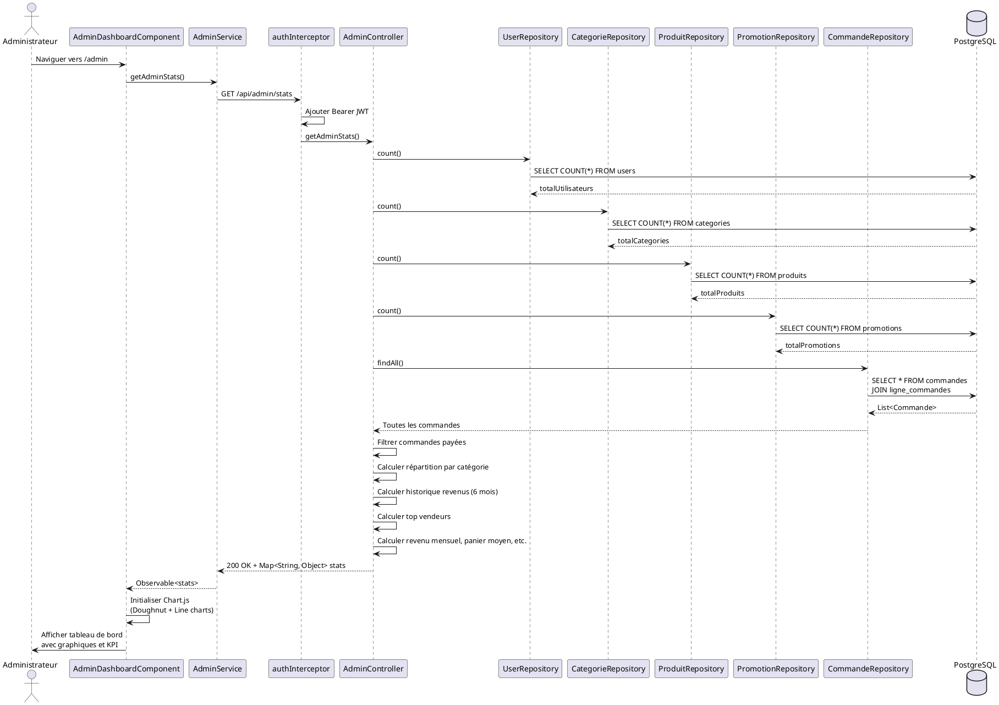

---

## 15. Diagramme d'activité

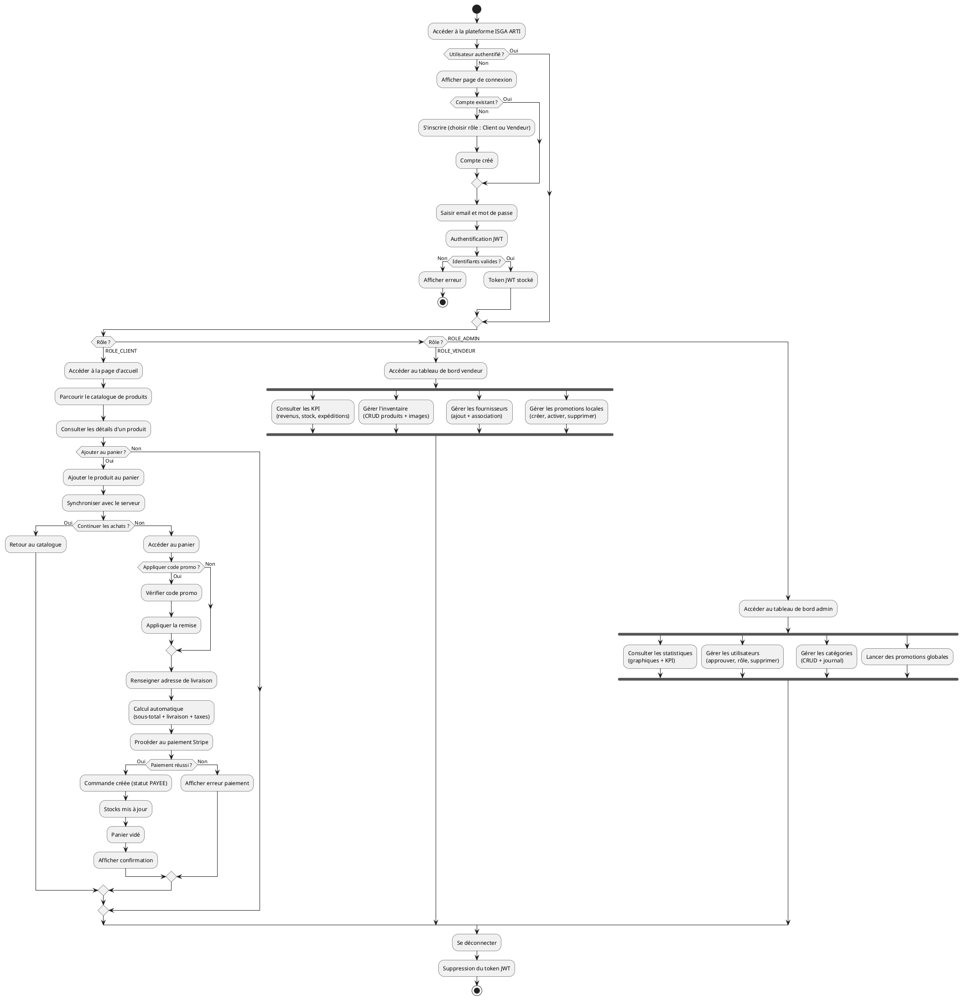

---

## 16. Diagramme de classes métier

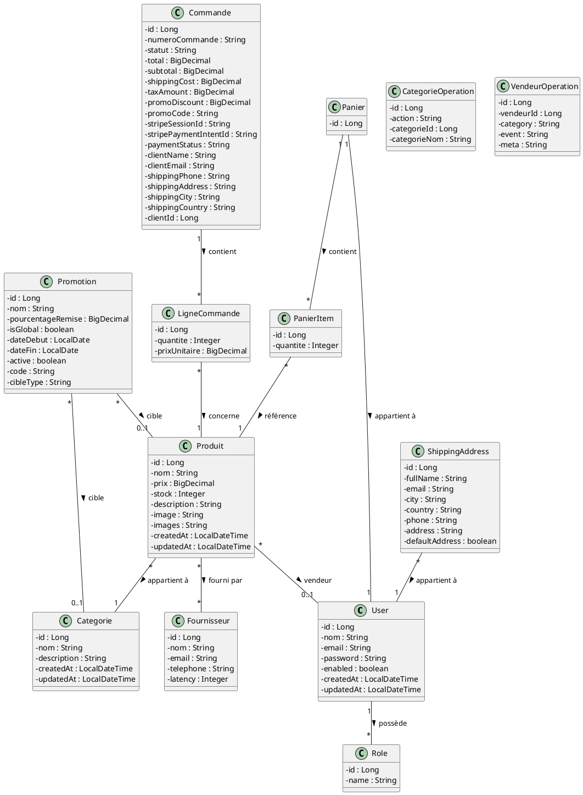

---

## 17. Diagramme de classes d'analyse

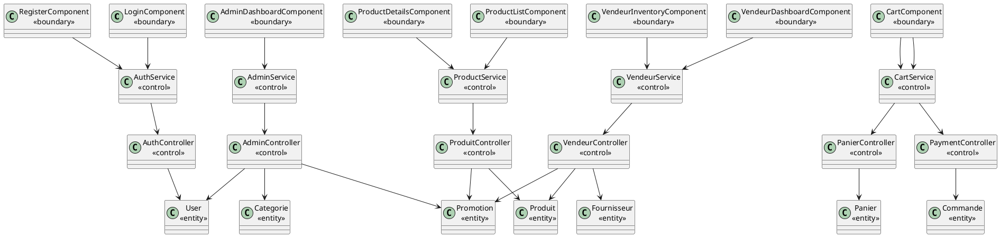

---

## 18. Diagramme de classes de conception

```plantuml
@startuml
skinparam defaultFontName Arial
skinparam classAttributeIconSize 0
skinparam classFontSize 10

package "Frontend Angular" {
  class AuthService {
    - tokenSignal : Signal<string>
    - userSignal : Signal<User>
    + login(credentials) : Observable
    + register(userData) : Observable
    + logout() : void
    + getToken() : string
    + hasRole(role) : boolean
    + isAuthenticated : computed
    + currentUser : computed
  }

  class CartService {
    - cartItems : Signal<CartItem[]>
    + items : computed
    + count : computed
    + total : computed
    + addToCart(product) : void
    + updateQuantity(id, qty) : void
    + removeFromCart(id) : void
    + clearCart() : void
  }

  class ProductService {
    + getProducts() : Observable<Produit[]>
    + getProduct(id) : Observable<Produit>
    + createProduct(data) : Observable<Produit>
    + getCategories() : Observable<Categorie[]>
  }

  class AdminService {
    + getAllUsers() : Observable<any[]>
    + approveUser(id) : Observable
    + updateUserRole(id, role) : Observable
    + deleteUser(id) : Observable
    + getAllCategories() : Observable<any[]>
    + creerCategorie(data) : Observable
    + updateCategorie(id, data) : Observable
    + deleteCategorie(id) : Observable
    + getAllPromotions() : Observable<any[]>
    + lancerPromotionGlobale() : Observable
    + getAdminStats() : Observable
  }

  class VendeurService {
    + getMesProduits() : Observable<Produit[]>
    + getDashboard() : Observable<VendeurDashboardData>
    + addProduit(data) : Observable<Produit>
    + updateProduit(id, data) : Observable<Produit>
    + deleteProduit(id) : Observable
    + getFournisseurs() : Observable<Fournisseur[]>
    + addFournisseur(data) : Observable<Fournisseur>
    + associerFournisseurs(id, ids) : Observable
    + addPromotionLocale(id, promo) : Observable
    + uploadImage(file) : Observable<{url}>
  }
}

package "Backend Spring Boot" {
  class AuthController {
    + registerUser(SignupRequest) : ResponseEntity
    + authenticateUser(LoginRequest) : ResponseEntity
  }

  class AdminController {
    + getAllUsers() : ResponseEntity
    + approveUser(userId) : ResponseEntity
    + updateUserRole(userId, payload) : ResponseEntity
    + deleteUser(userId) : ResponseEntity
    + getAllCategories() : ResponseEntity
    + createCategorie(categorie) : ResponseEntity
    + getAllPromotions() : ResponseEntity
    + lancerPromotionGlobale(payload) : ResponseEntity
    + getAdminStats() : ResponseEntity
  }

  class ProduitController {
    + getAllProduits() : ResponseEntity
    + getProduitById(id) : ResponseEntity
    + createProduit(produitData) : ResponseEntity
  }

  class PanierController {
    + getCart(principal) : ResponseEntity
    + addItem(payload, principal) : ResponseEntity
    + mergeCart(items, principal) : ResponseEntity
    + updateQuantity(productId, payload, principal) : ResponseEntity
    + removeItem(productId, principal) : ResponseEntity
    + clearCart(principal) : ResponseEntity
    + applyPromo(payload, principal) : ResponseEntity
  }

  class PaymentController {
    + createCheckoutSession(payload, principal) : ResponseEntity
    + confirmStripeSession(sessionId, principal) : ResponseEntity
    + createPaymentIntent(payload, principal) : ResponseEntity
    + confirmPaymentIntent(intentId, principal) : ResponseEntity
    + stripeConfig() : ResponseEntity
  }

  class VendeurController {
    + getMesProduits(principal) : ResponseEntity
    + getDashboard(principal) : ResponseEntity
    + addProduit(payload, principal) : ResponseEntity
    + updateProduit(id, payload, principal) : ResponseEntity
    + deleteProduit(id, principal) : ResponseEntity
    + getFournisseurs() : ResponseEntity
    + addFournisseur(fournisseur, principal) : ResponseEntity
    + associerFournisseur(id, payload, principal) : ResponseEntity
    + addPromotionLocale(id, payload, principal) : ResponseEntity
    + togglePromotionLocale(id, principal) : ResponseEntity
    + uploadImage(file, principal) : ResponseEntity
  }
}

package "Repositories" {
  interface UserRepository
  interface RoleRepository
  interface ProduitRepository
  interface CategorieRepository
  interface CommandeRepository
  interface PanierRepository
  interface PanierItemRepository
  interface PromotionRepository
  interface FournisseurRepository
  interface ShippingAddressRepository
}

AuthService ..> AuthController : HTTP REST
CartService ..> PanierController : HTTP REST
CartService ..> PaymentController : HTTP REST
ProductService ..> ProduitController : HTTP REST
AdminService ..> AdminController : HTTP REST
VendeurService ..> VendeurController : HTTP REST

AuthController --> UserRepository
AuthController --> RoleRepository
AdminController --> UserRepository
AdminController --> CategorieRepository
AdminController --> PromotionRepository
AdminController --> ProduitRepository
AdminController --> CommandeRepository
ProduitController --> ProduitRepository
ProduitController --> PromotionRepository
PanierController --> PanierRepository
PanierController --> PanierItemRepository
PanierController --> ProduitRepository
PaymentController --> PanierRepository
PaymentController --> CommandeRepository
PaymentController --> ProduitRepository
VendeurController --> ProduitRepository
VendeurController --> FournisseurRepository
VendeurController --> PromotionRepository

@enduml
```

---

## 19. Diagramme de navigation

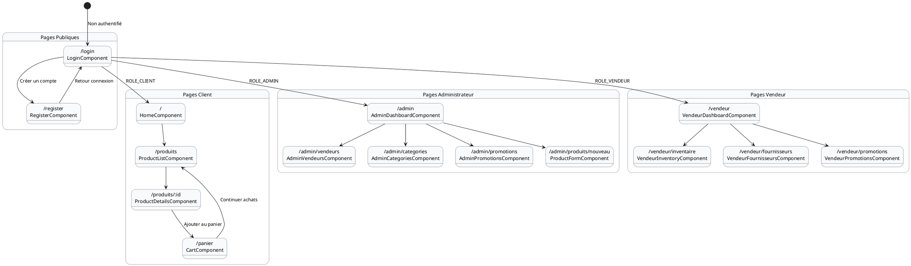

---

## 20. Diagramme de composants global

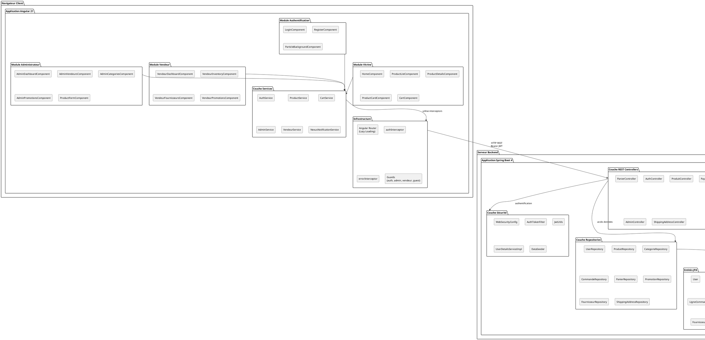

---

## 21. Modèle de données

### 21.1 Description des tables

| Table | Clé primaire | Description |
|---|---|---|
| `users` | `id (BIGINT, AUTO)` | Comptes utilisateurs avec nom, email unique, mot de passe hashé BCrypt, statut enabled |
| `roles` | `id (BIGINT, AUTO)` | Rôles système : ROLE_ADMIN, ROLE_VENDEUR, ROLE_CLIENT |
| `user_roles` | `user_id + role_id` | Table d'association ManyToMany entre users et roles |
| `produits` | `id (BIGINT, AUTO)` | Articles scolaires avec prix (DECIMAL 10,2), stock, description, image, galerie, FK catégorie, FK vendeur |
| `categories` | `id (BIGINT, AUTO)` | Catégories de produits avec nom unique et description |
| `commandes` | `id (BIGINT, AUTO)` | Commandes avec numéro unique, statut, total, informations Stripe et livraison |
| `ligne_commandes` | `id (BIGINT, AUTO)` | Lignes de commande avec quantité et prix unitaire figé au moment de l'achat |
| `paniers` | `id (BIGINT, AUTO)` | Paniers clients (OneToOne avec users) |
| `panier_items` | `id (BIGINT, AUTO)` | Articles dans le panier (contrainte unique panier_id + produit_id) |
| `promotions` | `id (BIGINT, AUTO)` | Promotions avec pourcentage, dates, type cible (GLOBAL, CATEGORIE, PRODUIT), code promo |
| `fournisseurs` | `id (BIGINT, AUTO)` | Fournisseurs avec nom, email unique, téléphone, latence simulée |
| `produit_fournisseur` | `produit_id + fournisseur_id` | Table d'association ManyToMany entre produits et fournisseurs |
| `shipping_addresses` | `id (BIGINT, AUTO)` | Adresses de livraison clients avec nom, email, ville, pays, téléphone, adresse, flag par défaut |
| `categorie_operations` | `id (BIGINT, AUTO)` | Journal d'audit des opérations sur les catégories (CREATE, EDIT, DELETE) |
| `vendeur_operations` | `id (BIGINT, AUTO)` | Journal d'audit des opérations du vendeur (PRODUIT, PROMO, FOURNISSEUR, etc.) |

### 21.2 Relations et cardinalités

| Relation | Type | Description |
|---|---|---|
| User ↔ Role | ManyToMany | Un utilisateur peut avoir plusieurs rôles, un rôle peut être attribué à plusieurs utilisateurs |
| Produit → Categorie | ManyToOne | Un produit appartient à une catégorie (obligatoire) |
| Produit → User (vendeur) | ManyToOne | Un produit est associé à un vendeur (optionnel) |
| Produit ↔ Fournisseur | ManyToMany | Un produit peut avoir plusieurs fournisseurs et inversement |
| Commande → LigneCommande | OneToMany | Une commande contient plusieurs lignes de commande |
| LigneCommande → Produit | ManyToOne | Une ligne de commande référence un produit |
| Panier → User | OneToOne | Chaque client a un seul panier |
| Panier → PanierItem | OneToMany | Un panier contient plusieurs articles |
| PanierItem → Produit | ManyToOne | Chaque article du panier référence un produit |
| Promotion → Produit | ManyToOne | Une promotion peut cibler un produit spécifique (optionnel) |
| Promotion → Categorie | ManyToOne | Une promotion peut cibler une catégorie (optionnel) |
| ShippingAddress → User | ManyToOne | Un client peut avoir plusieurs adresses de livraison |

### 21.3 Diagramme ER

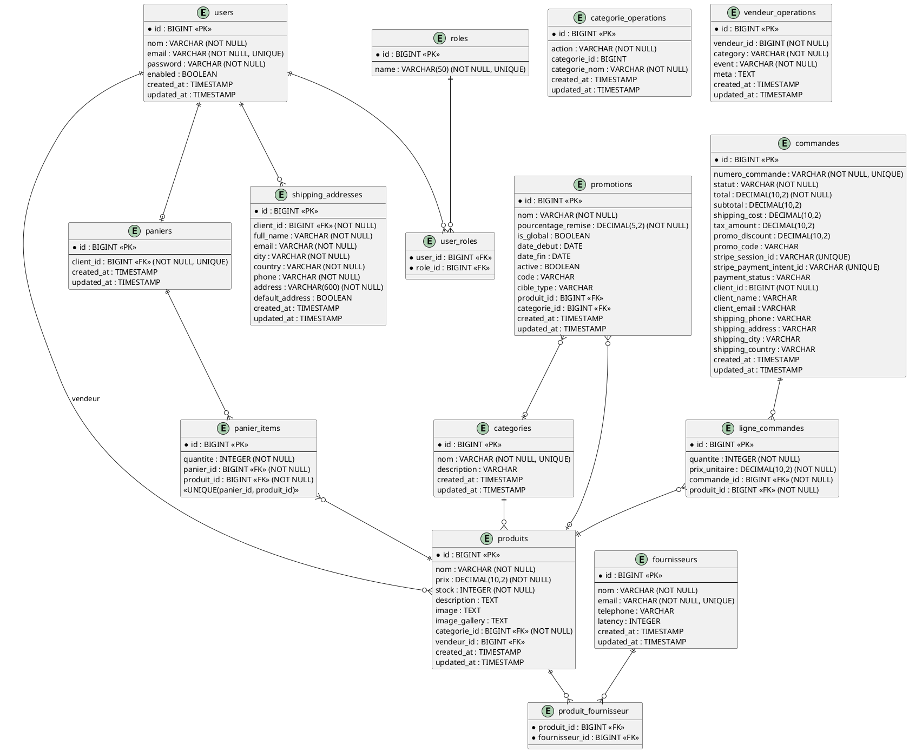

---

## 22. Documentation des API REST

### 22.1 Authentification (`AuthController`)

| Méthode | URL | Description | Body | Accès |
|---|---|---|---|---|
| POST | `/api/auth/signup` | Inscription d'un nouvel utilisateur | `SignupRequest {nom, email, password, roles[]}` | Public |
| POST | `/api/auth/signin` | Connexion, retourne un token JWT | `LoginRequest {email, password}` | Public |

### 22.2 Produits (`ProduitController`)

| Méthode | URL | Description | Body | Accès |
|---|---|---|---|---|
| GET | `/api/produits` | Liste tous les produits avec promotions actives | — | Public |
| GET | `/api/produits/{id}` | Détails d'un produit spécifique | — | Public |
| POST | `/api/produits` | Création d'un nouveau produit | `Produit {nom, prix, stock, categorie{id}, ...}` | VENDEUR |

### 22.3 Administration (`AdminController`)

| Méthode | URL | Description | Body | Accès |
|---|---|---|---|---|
| GET | `/api/admin/utilisateurs` | Liste tous les utilisateurs | — | ADMIN |
| GET | `/api/admin/utilisateurs/pending` | Liste les utilisateurs non approuvés | — | ADMIN |
| PUT | `/api/admin/utilisateurs/{id}/approve` | Approuve un utilisateur | `{}` | ADMIN |
| PUT | `/api/admin/utilisateurs/{id}/role` | Modifie le rôle d'un utilisateur | `{role: "ADMIN"}` | ADMIN |
| DELETE | `/api/admin/utilisateurs/{id}` | Supprime un utilisateur | — | ADMIN |
| GET | `/api/categories` | Liste toutes les catégories | — | Authentifié |
| GET | `/api/categories/operations` | Liste les 8 dernières opérations sur les catégories | — | ADMIN |
| POST | `/api/categories` | Crée une catégorie | `Categorie {nom, description}` | ADMIN |
| PUT | `/api/categories/{id}` | Modifie une catégorie | `Categorie {nom, description}` | ADMIN |
| DELETE | `/api/categories/{id}` | Supprime une catégorie | — | ADMIN |
| GET | `/api/promotions` | Liste toutes les promotions | — | Authentifié |
| POST | `/api/promotions/global` | Lance une promotion globale | `{pourcentage, dateFin, code, cibleType, cibleId}` | ADMIN |
| PUT | `/api/promotions/{id}/toggle` | Active/désactive une promotion | `{}` | ADMIN |
| DELETE | `/api/promotions/{id}` | Supprime une promotion | — | ADMIN |
| GET | `/api/admin/stats` | Statistiques globales de la plateforme | — | ADMIN |

### 22.4 Panier (`PanierController`)

| Méthode | URL | Description | Body | Accès |
|---|---|---|---|---|
| GET | `/api/cart` | Récupère le panier du client | — | CLIENT |
| POST | `/api/cart/items` | Ajoute un article au panier | `{productId, quantity}` | CLIENT |
| POST | `/api/cart/merge` | Fusionne le panier local avec le serveur | `[{productId, quantity}, ...]` | CLIENT |
| PUT | `/api/cart/items/{productId}` | Modifie la quantité d'un article | `{quantity}` | CLIENT |
| DELETE | `/api/cart/items/{productId}` | Supprime un article du panier | — | CLIENT |
| DELETE | `/api/cart` | Vide tout le panier | — | CLIENT |
| POST | `/api/cart/promo/apply` | Applique un code promotionnel | `{code}` | CLIENT |

### 22.5 Paiement (`PaymentController`)

| Méthode | URL | Description | Body | Accès |
|---|---|---|---|---|
| GET | `/api/payments/stripe/config` | Récupère la clé publique Stripe | — | Authentifié |
| POST | `/api/payments/stripe/checkout-session` | Crée une session Stripe Checkout | `{fullName, address, city, country, phone, promoCode}` | CLIENT |
| GET | `/api/payments/stripe/session/{sessionId}` | Confirme le paiement d'une session | — | CLIENT |
| POST | `/api/payments/stripe/payment-intent` | Crée un PaymentIntent Stripe | `{promoCode}` | CLIENT |
| GET | `/api/payments/stripe/payment-intent/{id}` | Confirme un PaymentIntent | — | CLIENT |

### 22.6 Vendeur (`VendeurController`)

| Méthode | URL | Description | Body | Accès |
|---|---|---|---|---|
| GET | `/api/vendeur/produits` | Liste les produits du vendeur | — | VENDEUR |
| GET | `/api/vendeur/dashboard` | Données du tableau de bord vendeur | — | VENDEUR |
| POST | `/api/vendeur/produits` | Ajoute un produit | `{nom, prix, stock, description, categorieId, image, images}` | VENDEUR |
| PUT | `/api/vendeur/produits/{id}` | Modifie un produit | Champs à modifier | VENDEUR |
| DELETE | `/api/vendeur/produits/{id}` | Supprime un produit | — | VENDEUR |
| GET | `/api/vendeur/fournisseurs` | Liste les fournisseurs | — | VENDEUR |
| POST | `/api/vendeur/fournisseurs` | Ajoute un fournisseur | `Fournisseur {nom, email, telephone}` | VENDEUR |
| POST | `/api/vendeur/produits/{id}/fournisseurs` | Associe des fournisseurs à un produit | `{fournisseurIds: []}` | VENDEUR |
| POST | `/api/vendeur/produits/{id}/promotion` | Ajoute une promotion locale | `{pourcentage, dateFin, nom, code}` | VENDEUR |
| DELETE | `/api/vendeur/produits/{id}/promotion` | Supprime les promotions d'un produit | — | VENDEUR |
| PATCH | `/api/vendeur/produits/{id}/promotion/toggle` | Active/désactive les promotions d'un produit | — | VENDEUR |
| PATCH | `/api/vendeur/promotions/{id}/toggle` | Active/désactive une promotion par ID | — | VENDEUR |
| DELETE | `/api/vendeur/promotions/{id}` | Supprime une promotion par ID | — | VENDEUR |
| POST | `/api/vendeur/upload-image` | Upload d'image vers ImageKit.io | `multipart/form-data (file)` | VENDEUR |

### 22.7 Adresses de livraison (`ShippingAddressController`)

| Méthode | URL | Description | Body | Accès |
|---|---|---|---|---|
| GET | `/api/shipping-addresses` | Liste les adresses du client | — | CLIENT |
| POST | `/api/shipping-addresses` | Enregistre une nouvelle adresse | `{fullName, email, city, country, phone, address}` | CLIENT |

---

## 23. Sécurité

### 23.1 Authentification

L'application utilise un système d'authentification **stateless basé sur JWT** :

1. **Inscription** (`POST /api/auth/signup`) : le mot de passe est hashé avec **BCrypt** avant stockage en base.
2. **Connexion** (`POST /api/auth/signin`) : Spring Security vérifie les identifiants via `AuthenticationManager`, puis `JwtUtils` génère un token JWT signé en **HS256** avec une expiration de 24 heures (86400000 ms).
3. **Validation des requêtes** : chaque requête passe par `AuthTokenFilter` (extends `OncePerRequestFilter`) qui :
   - Extrait le token de l'en-tête `Authorization: Bearer <token>`
   - Valide la signature et l'expiration via `JwtUtils.validateJwtToken()`
   - Charge les détails utilisateur via `UserDetailsServiceImpl`
   - Configure le `SecurityContextHolder`

### 23.2 Autorisation

- **Annotations `@PreAuthorize`** : les contrôleurs utilisent `@PreAuthorize("hasRole('ADMIN')")`, `@PreAuthorize("hasRole('VENDEUR')")` pour restreindre l'accès aux endpoints.
- **Configuration URL-based** dans `WebSecurityConfig` : règles spécifiques par méthode HTTP et chemin (ex: `GET /api/produits` est public, `POST /api/produits` requiert VENDEUR).
- **Vérification de propriété** : `VendeurController` vérifie que le vendeur est bien propriétaire du produit avant modification/suppression via `ownsProduct()`.

### 23.3 Rôles

| Rôle | Accès |
|---|---|
| `ROLE_ADMIN` | Gestion des utilisateurs, catégories, promotions globales, statistiques |
| `ROLE_VENDEUR` | CRUD produits, fournisseurs, promotions locales, dashboard vendeur |
| `ROLE_CLIENT` | Panier, paiement, adresses de livraison |

### 23.4 Configuration CORS

Origines autorisées : `http://localhost:4200`, `http://localhost:4300`, `http://127.0.0.1:4200`, `http://127.0.0.1:4300`  
Méthodes autorisées : GET, POST, PUT, PATCH, DELETE, OPTIONS  
En-têtes exposés : `Authorization`

### 23.5 Guards Angular

| Guard | Protection frontend |
|---|---|
| `authGuard` | Redirige vers `/login` si non authentifié |
| `adminGuard` | Vérifie `ROLE_ADMIN`, redirige intelligemment selon le rôle |
| `vendeurGuard` | Vérifie `ROLE_VENDEUR`, redirige intelligemment selon le rôle |
| `guestGuard` | Empêche l'accès aux pages d'auth pour les utilisateurs déjà connectés |

### 23.6 Intercepteurs Angular

- **`authInterceptor`** : injection automatique du token JWT dans chaque requête
- **`errorInterceptor`** : traitement centralisé des erreurs HTTP 401 et 403

---

## 24. Gestion des erreurs et validation

### 24.1 Validation backend

| Mécanisme | Détail |
|---|---|
| **Jakarta Validation** | `@NotBlank`, `@Email` sur les DTOs `LoginRequest` et `SignupRequest` |
| **`@Valid`** | Annotation sur les paramètres de contrôleur pour déclencher la validation |
| **Validations manuelles** | Vérification de l'existence des entités (`findById().orElseThrow()`), vérification de l'unicité de l'email (`existsByEmail()`), vérification de la catégorie lors de la création de produit |
| **Contraintes JPA** | `@Column(nullable = false)`, `@Column(unique = true)`, `@UniqueConstraint` sur `panier_items` |

### 24.2 Gestion des erreurs backend

| Code HTTP | Situation |
|---|---|
| 200 | Succès |
| 400 | Email déjà utilisé, panier vide, catégorie manquante |
| 401 | Token JWT invalide ou expiré (`AuthEntryPointJwt`) |
| 403 | Accès refusé (produit hors périmètre vendeur) |
| 404 | Ressource non trouvée (`ResponseEntity.notFound().build()`) |
| 502 | Erreur de communication avec Stripe |
| 503 | Stripe non configuré |

### 24.3 Gestion des erreurs frontend

| Mécanisme | Détail |
|---|---|
| **`errorInterceptor`** | Capture globale des erreurs 401 et 403, déconnexion si authentification invalide |
| **`NexusNotificationService`** | Affichage de notifications toast (succès, erreur, info) avec auto-suppression |
| **Gestion dans les services** | `subscribe({error: ...})` dans `CartService` avec fallback vers localStorage en cas d'erreur serveur |

### 24.4 Améliorations recommandées

- Implémenter un `@ControllerAdvice` global pour centraliser la gestion des exceptions backend
- Ajouter des classes d'exception personnalisées (`ResourceNotFoundException`, `UnauthorizedException`)
- Enrichir les messages d'erreur avec des codes métier standardisés
- Ajouter la validation côté frontend avec les Reactive Forms Angular et les messages d'erreur inline

---

## 25. Tests et validation

### 25.1 État actuel

Le projet ne contient pas de suite de tests automatisés dédiée au-delà des configurations de test générées par Spring Boot. Les tests ont été réalisés manuellement via l'interface utilisateur et des outils comme Postman.

### 25.2 Stratégie de tests recommandée

#### Tests unitaires (Backend)

| Outil | Cible |
|---|---|
| **JUnit 5** | Tester la logique de `calculatePricing()`, `mapProductToDto()`, validation des promotions |
| **Mockito** | Mocker les repositories pour tester les contrôleurs isolément |
| **Spring Boot Test** | Tester les configurations de sécurité et les filtres JWT |

#### Tests d'intégration (Backend)

| Outil | Cible |
|---|---|
| **`@SpringBootTest`** | Tester le flux complet inscription → connexion → panier → commande |
| **H2 Database** | Base en mémoire pour les tests d'intégration |
| **TestRestTemplate** | Simuler des requêtes HTTP vers les contrôleurs |

#### Tests API (Postman)

| Collection | Tests |
|---|---|
| Auth | Signup avec rôles valides/invalides, Signin avec identifiants corrects/incorrects |
| Produits | GET catalogue, GET détail, POST création avec/sans catégorie |
| Panier | Ajout, merge, modification quantité, suppression, application promo |
| Paiement | Création session Stripe, confirmation |
| Admin | CRUD utilisateurs, catégories, promotions, stats |
| Vendeur | CRUD produits, fournisseurs, promotions, dashboard |

#### Tests frontend

| Outil | Cible |
|---|---|
| **Jasmine / Karma** | Tests unitaires des services Angular (AuthService, CartService) |
| **Cypress** | Tests end-to-end du parcours client complet |

### 25.3 Tableau de validation fonctionnelle

| N° | Scénario | Résultat attendu | Validé |
|---|---|---|---|
| 1 | Inscription Client | Compte créé avec ROLE_CLIENT | ☑ |
| 2 | Inscription Vendeur | Compte créé avec ROLE_VENDEUR | ☑ |
| 3 | Connexion avec identifiants valides | Token JWT retourné, redirection | ☑ |
| 4 | Connexion avec identifiants invalides | Erreur 401 affichée | ☑ |
| 5 | Consultation du catalogue | Liste des produits avec promotions | ☑ |
| 6 | Ajout au panier | Panier mis à jour, compteur incrémenté | ☑ |
| 7 | Application code promo valide | Remise appliquée | ☑ |
| 8 | Application code promo invalide | Message d'erreur | ☑ |
| 9 | Paiement Stripe réussi | Commande créée, stock décrémenté, panier vidé | ☑ |
| 10 | Ajout produit (Vendeur) | Produit créé avec vendeur associé | ☑ |
| 11 | Modification rôle (Admin) | Rôle mis à jour | ☑ |
| 12 | Création catégorie (Admin) | Catégorie créée, opération journalisée | ☑ |
| 13 | Accès non autorisé | Redirection par guard ou erreur 403 | ☑ |

---

## 26. Installation et lancement

### 26.1 Prérequis

| Logiciel | Version minimale |
|---|---|
| **Java JDK** | 17+ |
| **Node.js** | 18+ |
| **npm** | 10.9+ |
| **PostgreSQL** | 14+ |
| **Maven** | 3.9+ (ou utiliser le wrapper `mvnw` inclus) |

### 26.2 Configuration de la base de données

```sql
-- Créer la base de données PostgreSQL
CREATE DATABASE boutique_db;
```

### 26.3 Configuration du backend

Le fichier de configuration se trouve dans `backend/boutique/src/main/resources/application.properties` :

```properties
spring.datasource.url=jdbc:postgresql://localhost:5432/boutique_db
spring.datasource.username=postgres
spring.datasource.password=VOTRE_MOT_DE_PASSE

spring.jpa.hibernate.ddl-auto=update

boutique.app.jwtSecret=VOTRE_CLE_SECRETE_LONGUE
boutique.app.jwtExpirationMs=86400000

stripe.secret.key=sk_test_VOTRE_CLE_STRIPE
stripe.publishable.key=pk_test_VOTRE_CLE_STRIPE
```

> **Important** : Remplacer les valeurs par vos propres clés. Ne jamais committer de clés secrètes dans un dépôt public.

### 26.4 Lancement du backend

```bash
cd backend/boutique
./mvnw spring-boot:run
```

Le serveur démarre sur `http://localhost:8080`.

Au premier démarrage, les rôles (ROLE_ADMIN, ROLE_VENDEUR, ROLE_CLIENT) et un administrateur par défaut (`admin@isga.ma` / `admin123`) sont automatiquement créés.

### 26.5 Lancement du frontend

```bash
cd frontend
npm install
npm run dev
```

L'application Angular démarre sur `http://localhost:4300`.

---

## 27. Structure du projet

```
store pro/
├── .github/                          # Configuration GitHub
├── backend/
│   └── boutique/                     # Projet Spring Boot
│       ├── src/
│       │   └── main/
│       │       ├── java/com/isga/boutique/
│       │       │   ├── BoutiqueApplication.java     # Point d'entrée + CORS + DataInit
│       │       │   ├── controllers/                  # 7 contrôleurs REST
│       │       │   │   ├── AuthController.java
│       │       │   │   ├── AdminController.java
│       │       │   │   ├── ProduitController.java
│       │       │   │   ├── PanierController.java
│       │       │   │   ├── PaymentController.java
│       │       │   │   ├── VendeurController.java
│       │       │   │   └── ShippingAddressController.java
│       │       │   ├── models/                       # 14 entités JPA
│       │       │   │   ├── BaseEntity.java
│       │       │   │   ├── User.java
│       │       │   │   ├── Role.java
│       │       │   │   ├── Produit.java
│       │       │   │   ├── Categorie.java
│       │       │   │   ├── Commande.java
│       │       │   │   ├── LigneCommande.java
│       │       │   │   ├── Panier.java
│       │       │   │   ├── PanierItem.java
│       │       │   │   ├── Promotion.java
│       │       │   │   ├── Fournisseur.java
│       │       │   │   ├── ShippingAddress.java
│       │       │   │   ├── CategorieOperation.java
│       │       │   │   └── VendeurOperation.java
│       │       │   ├── repositories/                 # 12 interfaces JpaRepository
│       │       │   ├── security/                     # 7 classes de sécurité
│       │       │   └── payload/                      # 2 DTOs de requête
│       │       └── resources/
│       │           └── application.properties
│       └── pom.xml                                   # Dépendances Maven
└── frontend/                         # Projet Angular 21
    ├── src/app/
    │   ├── app.ts                    # Composant racine
    │   ├── app.config.ts             # Providers + interceptors + icons
    │   ├── app.routes.ts             # 15 routes lazy-loaded
    │   ├── core/                     # Guards, interceptors, services
    │   ├── features/                 # auth, admin, vendeur, storefront
    │   └── shared/                   # layout (shell, dock), components
    ├── package.json                  # Dépendances npm
    ├── tailwind.config.js
    └── tsconfig.json
```

---

## 28. Captures d'écran

> *Les captures d'écran ci-dessous sont à inclure dans le rapport final. Chaque emplacement correspond à une page réelle de l'application.*

| N° | Page | Description |
|---|---|---|
| 1 | **Page de connexion** (`/login`) | Formulaire de connexion avec animation de particules en arrière-plan |
| 2 | **Page d'inscription** (`/register`) | Formulaire d'inscription avec choix du rôle (Client/Vendeur) |
| 3 | **Page d'accueil** (`/`) | Page d'accueil après connexion avec navigation contextuelle selon le rôle |
| 4 | **Catalogue produits** (`/produits`) | Liste des produits avec cartes, images, prix, badges promo et filtres par catégorie |
| 5 | **Détail produit** (`/produits/:id`) | Page détaillée avec galerie d'images, description, informations vendeur et promotions |
| 6 | **Panier** (`/panier`) | Panier d'achat avec modification des quantités, application de code promo, calcul du total avec frais et taxes |
| 7 | **Paiement Stripe** | Formulaire de paiement Stripe embarqué dans la page panier |
| 8 | **Confirmation de commande** | Récapitulatif de la commande après paiement réussi |
| 9 | **Dashboard Admin** (`/admin`) | Tableau de bord avec KPI, graphique doughnut (répartition catégories), graphique ligne (historique revenus), alertes achats |
| 10 | **Gestion des vendeurs** (`/admin/vendeurs`) | Liste des utilisateurs avec actions d'approbation, modification de rôle et suppression |
| 11 | **Gestion des catégories** (`/admin/categories`) | CRUD des catégories avec journal des opérations récentes |
| 12 | **Gestion des promotions** (`/admin/promotions`) | Création de promotions globales avec ciblage (global, catégorie, produit) |
| 13 | **Dashboard Vendeur** (`/vendeur`) | Tableau de bord vendeur avec KPI, graphique de revenus, journal d'activité |
| 14 | **Inventaire Vendeur** (`/vendeur/inventaire`) | Gestion CRUD des produits avec upload d'images |
| 15 | **Fournisseurs** (`/vendeur/fournisseurs`) | Liste des fournisseurs avec association aux produits |
| 16 | **Promotions Vendeur** (`/vendeur/promotions`) | Gestion des promotions locales sur les produits du vendeur |

---

## 29. Difficultés rencontrées

### 29.1 Synchronisation du panier hybride

La conception d'un panier fonctionnant simultanément en mode local (localStorage) et en mode serveur (base de données) a constitué un défi technique majeur. La fusion des paniers lors de la connexion (`POST /api/cart/merge`) devait gérer les conflits de quantité sans dupliquer les articles, tout en assurant une cohérence des données entre le frontend (Signals Angular) et le backend.

### 29.2 Intégration Stripe sans SDK Java

L'intégration de Stripe a été réalisée sans utiliser le SDK officiel Java, en communiquant directement avec l'API REST de Stripe via `java.net.http.HttpClient`. Cette approche a nécessité la gestion manuelle de l'encodage des formulaires (`application/x-www-form-urlencoded`), la conversion des montants en unités mineures (centimes), et le parsing des réponses JSON.

### 29.3 Gestion des promotions multi-cibles

Le système de promotions supporte trois niveaux de ciblage (global, catégorie, produit) avec des codes promo. La logique de résolution des promotions applicable à un produit donné, en tenant compte des dates de validité et du statut actif, a requis une attention particulière pour éviter les conflits et garantir l'application de la meilleure promotion.

### 29.4 Sécurité multi-rôles

L'implémentation d'un système de sécurité supportant trois rôles avec des redirections intelligentes entre les espaces (admin, vendeur, client) a nécessité une configuration fine des guards Angular et des règles Spring Security, en évitant les boucles de redirection.

### 29.5 Architecture sans couche service

L'absence d'une couche de services Spring (les contrôleurs communiquent directement avec les repositories) a parfois conduit à une logique métier dense dans les contrôleurs, notamment dans `AdminController` (358 lignes) et `VendeurController` (587 lignes).

---

## 30. Solutions apportées

### 30.1 Séparation des responsabilités

L'architecture adopte une séparation stricte entre le frontend (présentation et interaction utilisateur) et le backend (logique métier et accès aux données). Chaque module Angular possède son propre service dédié qui encapsule les appels HTTP, assurant un couplage faible entre les composants et l'API.

### 30.2 API REST standardisée

L'ensemble de la communication passe par des endpoints REST clairement définis, suivant les conventions HTTP (GET pour la lecture, POST pour la création, PUT/PATCH pour la modification, DELETE pour la suppression). Les réponses sont structurées en JSON avec des codes HTTP appropriés.

### 30.3 Architecture modulaire Angular

L'utilisation de Standalone Components avec lazy-loading permet un chargement à la demande des modules, réduisant le bundle initial. La structure `core/features/shared` assure une organisation scalable du code frontend.

### 30.4 Pattern Repository Spring Data JPA

L'utilisation d'interfaces JpaRepository permet un accès déclaratif aux données, avec des requêtes dérivées des noms de méthodes (ex: `findByClientIdOrderByDefaultAddressDescUpdatedAtDesc`), éliminant le code SQL boilerplate.

### 30.5 État réactif avec Signals

L'adoption des Signals Angular dans `AuthService` et `CartService` offre une gestion d'état réactive et performante, avec des `computed` signals pour les valeurs dérivées (total du panier, compteur d'articles, état d'authentification).

### 30.6 Panier intelligent hybride

Le `CartService` implémente un pattern de synchronisation bidirectionnelle : opérations optimistes en local (mise à jour immédiate du Signal) suivies d'une synchronisation serveur, avec fallback vers localStorage en cas d'erreur.

### 30.7 Traçabilité des opérations

Les entités `CategorieOperation` et `VendeurOperation` assurent un journal d'audit complet des actions effectuées par les administrateurs et vendeurs, facilitant le suivi et le débogage.

---

## 31. Améliorations futures

### 31.1 Architecture et code

- **Couche service backend** : introduire des classes `@Service` (ProductService, OrderService, etc.) pour extraire la logique métier des contrôleurs et respecter le principe de responsabilité unique.
- **Interfaces TypeScript complètes** : remplacer tous les `any` par des interfaces strictement typées dans les services Angular.
- **Gestion d'exceptions globale** : implémenter un `@ControllerAdvice` avec des classes d'exception personnalisées.
- **Variables d'environnement** : externaliser les secrets (Stripe, base de données, JWT) dans des variables d'environnement au lieu du fichier `application.properties`.

### 31.2 Fonctionnalités métier

- **Historique de commandes client** : permettre aux clients de consulter leurs commandes passées.
- **Recherche avancée** : implémenter une recherche full-text avec filtres (catégorie, fourchette de prix, tri).
- **Gestion du stock avancée** : alertes de stock bas, réapprovisionnement automatique.
- **Système d'avis** : permettre aux clients de noter et commenter les produits.
- **Notifications email** : confirmation de commande, changement de statut, bienvenue.
- **Génération de factures PDF** : export automatique des factures.
- **Tableau de bord client** : espace personnel avec historique, adresses, profil.

### 31.3 Infrastructure et déploiement

- **Docker** : conteneuriser le frontend, le backend et PostgreSQL avec Docker Compose.
- **CI/CD** : pipeline GitHub Actions pour les tests automatisés, le build et le déploiement.
- **HTTPS** : certificat SSL pour la production.
- **Pagination et tri** : implémenter `Pageable` de Spring Data pour les listes volumineuses.
- **Cache** : mise en cache des données fréquemment consultées (catalogue, catégories).

### 31.4 Tests

- **Tests unitaires** : JUnit 5 + Mockito pour le backend, Jasmine + Karma pour le frontend.
- **Tests d'intégration** : `@SpringBootTest` avec base H2.
- **Tests end-to-end** : Cypress pour les parcours utilisateur complets.
- **Tests de performance** : JMeter pour les tests de charge.

---

## 32. Conclusion générale

Le projet **ISGA ARTI** constitue une réalisation technique complète et ambitieuse dans le domaine du développement web full-stack. En combinant **Angular 21** et **Spring Boot 4**, cette plateforme e-commerce d'articles scolaires démontre la maîtrise des technologies modernes du développement web et l'application des principes fondamentaux du génie logiciel.

### Réalisations techniques

L'application implémente avec succès :
- Une **architecture client-serveur REST** complète avec 7 contrôleurs et plus de 40 endpoints API.
- Un **système d'authentification et d'autorisation JWT** complet avec gestion de trois rôles différenciés.
- Un **panier d'achat intelligent** avec synchronisation hybride (localStorage/base de données).
- Une **intégration de paiement Stripe** fonctionnelle avec Checkout Sessions et PaymentIntents.
- Des **tableaux de bord analytiques** riches pour les administrateurs et les vendeurs.
- Un **modèle de données relationnel** cohérent avec 14 entités et des relations complexes.
- Une **interface utilisateur réactive** basée sur les Signals Angular et le lazy-loading.

### Valeur académique

Ce projet a permis de développer des compétences transversales en :
- Conception et modélisation UML d'un système multi-acteurs.
- Développement frontend avec un framework SPA moderne (Angular 21, Standalone Components, Signals).
- Développement backend avec une architecture Spring Boot (Security, Data JPA, REST).
- Intégration de services externes (Stripe, ImageKit.io).
- Gestion de la sécurité applicative (JWT, BCrypt, CORS, RBAC).
- Gestion de bases de données relationnelles avec PostgreSQL et Hibernate ORM.

### Perspectives

La plateforme ISGA ARTI pose les fondations solides d'une application e-commerce professionnelle. Les améliorations identifiées — introduction d'une couche de services backend, tests automatisés, Docker, CI/CD — permettraient d'atteindre un niveau de maturité production. Le projet reste évolutif grâce à son architecture modulaire et ses choix technologiques pérennes.

---

## 33. Annexes

### Annexe A — Récapitulatif des diagrammes PlantUML

| N° | Diagramme | Section |
|---|---|---|
| 1 | Architecture globale | §7 |
| 2 | Cas d'utilisation | §12 |
| 3 | Séquence — Se connecter | §14 (DS1) |
| 4 | Séquence — Consulter le catalogue | §14 (DS2) |
| 5 | Séquence — Gérer le panier | §14 (DS3) |
| 6 | Séquence — Payer via Stripe | §14 (DS4) |
| 7 | Séquence — Gérer ses produits (Vendeur) | §14 (DS5) |
| 8 | Séquence — Consulter les statistiques (Admin) | §14 (DS6) |
| 9 | Activité — Parcours global | §15 |
| 10 | Classes métier | §16 |
| 11 | Classes d'analyse | §17 |
| 12 | Classes de conception | §18 |
| 13 | Navigation | §19 |
| 14 | Composants global | §20 |
| 15 | Entité-Relation (ER) | §21 |

### Annexe B — Récapitulatif des API REST

Total : **43 endpoints** répartis sur 7 contrôleurs REST.

| Contrôleur | Nombre d'endpoints |
|---|---|
| AuthController | 2 |
| ProduitController | 3 |
| AdminController | 13 |
| PanierController | 7 |
| PaymentController | 5 |
| VendeurController | 11 |
| ShippingAddressController | 2 |

### Annexe C — Commandes utiles

```bash
# Backend
cd backend/boutique
./mvnw spring-boot:run                  # Lancer le backend
./mvnw clean package                     # Compiler le projet
./mvnw clean package -DskipTests        # Compiler sans les tests

# Frontend
cd frontend
npm install                              # Installer les dépendances
npm run dev                              # Lancer en mode développement (port 4300)
npm run build                            # Build de production
ng generate component features/...       # Générer un composant

# Base de données
psql -U postgres -d boutique_db          # Accéder à la base PostgreSQL
```

### Annexe D — Compte administrateur par défaut

| Champ | Valeur |
|---|---|
| Email | `admin@isga.ma` |
| Mot de passe | `admin123` |
| Rôle | `ROLE_ADMIN` |

> Ce compte est créé automatiquement au premier démarrage si la base de données est vide.

---

*Document généré à partir de l'analyse exhaustive du code source du projet ISGA ARTI.*
